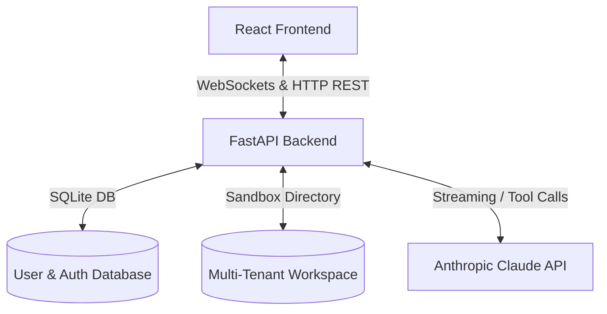

# Leon AI - Lightweight  Development Tool

Leon AI is a lightweight, multi-user prototype development platform designed to streamline software prototyping. It integrates a React-based frontend workspace with a FastAPI backend, enabling real-time AI assistance, code editing, previewing, and workspace terminal execution.

---

## 🏗️ Architecture Overview

The system follows a classic **Client-Server** architecture tailored for local development and real-time AI-assisted iteration:



### 1. Frontend (Vite + React + TypeScript)
The frontend serves as the primary developer cockpit. Key modules include:
*   **Workspace Explorer**: Multi-tenant file navigator displaying directory trees, supporting file/folder CRUD, uploads, and raw resource downloads. Now supports a **draggable, resizable sidebar** with width settings preserved in `localStorage`.
*   **Monaco Code Editor**: Web-based IDE powering syntax highlighting and code editing, integrated with a keyboard shortcut hook for instant saving (`Ctrl+S`).
*   **Multi-Device Canvas Preview**: A responsive design preview system that renders HTML and screen prototypes inside an iframe, with viewport switching (Desktop, Tablet, Mobile).
*   **AI Chat Assistant**: Streamed real-time chat with file attachment support (docx, pptx, images, code files) for prompt engineering and automated code writing.
*   **Terminal Panel**: Integrated command-line console running commands directly within the isolated workspace.
*   **Admin Dashboard**: CRUD interface for managing user accounts, passwords, and permissions.

### 2. Backend (FastAPI + SQLite + WebSockets)
The backend manages workspace sandboxing, user management, and coordinates the LLM agent tool-execution loop:
*   **`server/app.py`**: API Gateway exposing REST endpoints for user authentication, file administration, terminal shell execution, project exports, and the live Chat WebSockets `/ws/chat`.
*   **`server/db.py`**: SQLite database layer storing credentials, roles (`admin` / `user`), and creation timestamps.
*   **`server/chat/ws_handler.py`**: Coordinates WebSocket connections. Compiles active workspace details, builds prompt contexts, and runs the LLM processing stream.
*   **`server/chat/claude_client.py`**: Interacts with the Anthropic Claude API to stream text delta updates and invoke tool calls.
*   **`server/chat/tool_executor.py`**: Sandbox tool executor validating and running agent operations:
    *   `read_workspace_file`: Reads files inside user workspace or templates.
    *   `write_workspace_file`: Safely writes code into workspace directory files.
    *   `list_dir`: Recursively lists directories.
    *   `create_folder`: Automatically spawns folder structures.
    *   `run_terminal_command`: Executes terminal commands within the workspace environment, restricted against destructive operations.
*   **`server/chat/context_builder.py`**: Automatically parses and structures plain text, Word documents (`.docx`), and PowerPoint presentations (`.pptx`) using specialized parsers to feed context into the LLM.

---

## 📁 Directory Structure

```text
leonAI-development/
├── frontend/                     # React Vite frontend project
│   ├── src/
│   │   ├── App.tsx               # Main layout and client logic
│   │   ├── App.css               # Workspace styling & responsive rules
│   │   └── main.tsx              # React mounting root
│   ├── package.json              # Frontend npm dependencies
│   └── vite.config.ts            # Vite bundler configuration
│
├── server/                       # FastAPI python backend
│   ├── chat/                     # AI assistant and parsing module
│   │   ├── claude_client.py      # LLM API connection client
│   │   ├── context_builder.py    # Context assembly helper
│   │   ├── docx_parser.py        # Word document parser
│   │   ├── pptx_parser.py        # PowerPoint slide text parser
│   │   ├── tool_executor.py      # Agent sandbox tools
│   │   └── ws_handler.py         # WebSocket manager
│   ├── app.py                    # Main REST & WebSocket router
│   └── db.py                     # SQLite database abstraction
│
├── prompts/                      # System prompts & generation templates
│   ├── system-prompt.md          # Core AI guidelines & rules
│   ├── gen-product-charter.md    # Product charter prompt template
│   └── gen-prd.md                # PRD template
│
├── workspace/                    # Isolated multi-tenant workspace root
│   └── leon/
│       └── [username]/           # Isolated space for each user
│
├── start.py                      # Concurrently launches backend & frontend
├── start.bat                     # Windows bat launcher shortcut
├── requirements.txt              # Backend python packages
└── CLAUDE.md                     # File placement decision policies
```

---

## ⚙️ Setup & Installation

### Prerequisites
*   Node.js (v16+)
*   Python 3.8+
*   Anthropic API Key (placed in `.env`)

### 1. Configure Environment Variables
Create a `.env` file in the root directory:
```env
ANTHROPIC_API_KEY=your_claude_api_key_here
SERVER_HOST=127.0.0.1
SERVER_PORT=8900
FRONTEND_PORT=5173
```

### 2. Run the Application
The `start.py` script checks dependencies, sets up the workspace, and runs both servers concurrently:
```bash
python start.py
```
Or double-click `start.bat` on Windows. The application will launch automatically at `http://localhost:5173`.

---

## 🔐 Multi-Tenant Sandboxing

Leon AI implements sandboxing policies to prevent unauthorized file system access:
1.  **Isolated CWD Paths**: All workspace operations (`read`, `write`, `list`, `terminal`) resolve strictly within `workspace/leon/[username]/`.
2.  **Path Traversal Prevention**: Files paths are normalized and validated using `.resolve()`. Any path outside the user's workspace triggers a `403 Access Denied` error.
3.  **Command Filter**: Shell command terminal execution blocks destructive commands (e.g. `rmdir /s`, `taskkill`, `..`, etc.) to keep host systems secure.
